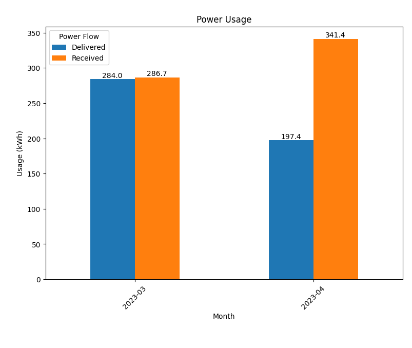
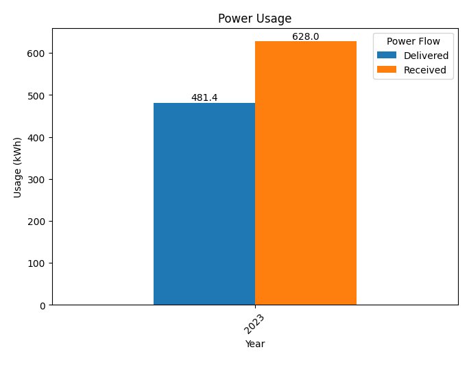

# NV Energy Data Plotter

## Description
This application reads in the raw csv data from an NV Energy usage request data dump and outputs a bar chart of usage and the csv data used in the chart. 

The output data differs from input since the data is grouped by the user chosen period grouping and the number of columns are reduced.

## Usage

### Recommended Install

#### Linux/MacOs
```console
$ python3 -m venv env
$ source env/bin/activate
$ pip3 install -r requirements.txt
```

#### Windows
```ps
> python -m venv env
> env/scripts/activate
> pip install -r requirements.txt
```

<br>

### Use via config file
This application supports usage via a config file. Simply put the name of the file to be plotted in the _file_name_ portion of the config.py file. Then, make sure the file is located in the _input/_ folder and run the script app.py.

#### Linux/MacOs
```console
$ source env/bin/activate
$ python3 app.py
```

#### Windows
```ps
> env/scripts/activate
> python app.py
```

<br>

### Use via terminal
This application supports usage via terminal arguments. Be sure all files are placed in the _input/_ folder.

#### Linux/MacOs
```ps
$ source env/bin/activate
# For day grouping
$ python3 app.py example0.csv example1.csv example2.csv ...
# For month grouping
$ python3 app.py -m example0.csv example1.csv example2.csv ...
# For year grouping
$ python3 app.py -y example0.csv example1.csv example2.csv ...
```

#### Windows
```ps
> env/scripts/activate
# For day grouping
> python app.py example0.csv example1.csv example2.csv ...
# For month grouping
> python app.py -m example0.csv example1.csv example2.csv ...
# For year grouping
> python app.py -y example0.csv example1.csv example2.csv ...
```

### Command Line Arguments
```
The below arguments must be placed before file names but after app.py
-d : Group the values by day 
-m : Group the values by month
-y : Group the values by year
```

## Examples




